# Deep learning for organic chemistry - utilizing deep learning techniques to identify chemical structures
## Carly Wolfbrandt

### Table of Contents
1. [Question](#Question)
2. [Introduction](#Introduction)
    1. [Skeletal Formulas](#skeletal_formulas) 
    2. [Simplified Molecular-Input Line-Entry System (SMILES)](#SMILES)
    3. [Building a Scalable Database](#database)
    4. [Small-Data Problem and Image Augmentation using Keras](#small-data)
3. [Convolutional Neural Network Model](#cnn)
    1. [Training Set](#train)
    2. [Image Augmentation Parameters](#aug)
    3. [Model Hyperparameters](#hp)
    4. [Model Architecture](#architecture)
    5. [Training](#train)
    6. [Performance and Predictions](#train)

## Question <a name="Question"></a>

Can I build a model that can correctly classify images of chemical structures?

## Introduction <a name="Introduction"></a>

### Skeletal Formulas <a name="skeletal_formulas"></a>

The skeletal formula of a chemical species is a type of molecular structural formula that serves as a shorthand representation of a molecule's bonding and contains some information about its molecular geometry. It is represented in two dimensions, and is usually hand-drawn as a shorthand representation for sketching species or reactions. This shorthand representation is particularly useful in that carbons and hydrogens, the two most common atoms in organic chemistry, don't need to be explicitly drawn.

**Table 1**: Examples of different chemical species' names, molecular formulas and skeletal formulas

| Common Name      | IUPAC Name | Molecular Formula | Skeletal Formula | 
| :-----------: | :-----------:| :-----------: | :----------:| 
| coronene      |  coronene | C<sub>24</sub>H<sub>12</sub> |  |
| biphenylene  | biphenylene | C<sub>12</sub>H<sub>8</sub> ||
|1-Phenylpropene | [(E)-prop-1-enyl]benzene | C<sub>9</sub>H<sub>10</sub>|   |

### Simplified Molecular-Input Line-Entry System (SMILES) <a name="SMILES"></a>

SMILES is a line notation for describing the structure of chemical elements or compounds using short ASCII strings. These strings can be thought of as a language, where atoms and bond symbols make up the vocabulary.  The SMILES strings contain the same information as the structural images, but are depicted in a different way.

SMILES strings use atoms and bond symbols to describe physical properties of chemical species in the same way that a drawing of the structure conveys information about elements and bonding orientation. This means that the SMILES string for each molecule is synonymous with its structure and since the strings are unique, the name is universal. These strings can be imported by most molecule editors for conversion into other chemical representations, including structural drawings and spectral predictions. 

**Table 2**: SMILES strings contrasted with skeletal formulas

| Common Name      | IUPAC Name |Molecular Formula | Skeletal Formula | Canonical SMILES | 
| :-----------: | :-----------:| :-----------: | :----------:|  :----------:| 
| coronene      |  coronene | C<sub>24</sub>H<sub>12</sub> |  | C1=CC2=C3C4=C1C=CC5=C4C6=C(C=C5)C=CC7=C6C3=C(C=C2)C=C7|
| biphenylene  | biphenylene | C<sub>12</sub>H<sub>8</sub> || C1=CC2=C3C=CC=CC3=C2C=C1|
|1-Phenylpropene | [(E)-prop-1-enyl]benzene | C<sub>9</sub>H<sub>10</sub>|   | CC=CC1=CC=CC=C1|

Perhaps the most important property of SMILES, as it relates to data science, is that the datatype is quite compact. SMILES structures average around 1.6 bytes per atom, compared to skeletal image files, which have an averge size of 4.0 kilobytes.

## Building a Scalable Database <a name="database"></a>

Since all chemical structures are unique, this means that there is only one correct way to represent every chemical species. This presents an interesting problem when trying to train a neural network to predict the name of a structure - by convention the datasets are going to be sparse. The [dataset](https://github.com/cwolfbrandt/csk_database/edit/master/README.md) has 9,691 rows, each with a unique name and link to a 300 x 300 pixel structural image, as shown in **Table 1**.

**Table 1**: Sample rows from the dataset

| SMILES      | Image URL | Skeletal Formula | 
| :-----------: |:-----------: | :-----------: |
|C=CCC1(CC=C)c2ccccc2-c2ccccc12| https://pubchem.ncbi.nlm.nih.gov/rest/pug/compound/smiles/C=CCC1(CC=C)c2ccccc2-c2ccccc12/PNG | |
|Cc1ccc(C=C)c2ccccc12| https://pubchem.ncbi.nlm.nih.gov/rest/pug/compound/smiles/Cc1ccc(C=C)c2ccccc12/PNG ||
|Cc1ccccc1\C=C\c1ccccc1	|  https://pubchem.ncbi.nlm.nih.gov/rest/pug/compound/smiles/Cc1ccccc1\C=C\c1ccccc1/PNG | | 

Generating the image URLs required URL encoding the SMILES strings, since the strings can contain characters which are not safe for URLs. This had the added benefit of making the SMILES strings safe for filenames as well. The final training dataset was in a directory architected based on [this blog post from the Keras website](https://blog.keras.io/building-powerful-image-classification-models-using-very-little-data.html), where the filenames are URL encoded SMILES strings.

## Convolutional Neural Network Model <a name="cnn"></a>

CNNs take advantage of the fact that the input consists of images and they constrain the architecture in a more sensible way. In particular, unlike a regular Neural Network, the layers of a CNN have neurons arranged in 3 dimensions: width, height, depth.

### Small-Data Problem and Image Augmentation using Keras <a name="small-data"></a>

There has been a recent explosion in research of modeling methods geared towards "big-data." Certainly, data science as a discipline has an obsession with big-data, as focus has shifted towards development of specialty methods to effectively analyze large datasets. However, an often overlooked problem in data science is small-data. It is generally (and perhaps incorrectly) believed that deep-learning is only applicable to big-data. 

It is true that deep-learning does usually require large amounts of training data in order to learn high-dimensional features of input samples. However, convolutional neural networks are one of the best models available for image classification, even when they have very little data from which to learn. Even so, Keras documentation defines small-data as 1000 images per class. This presents a particular challenge for the hydrocarbon dataset, where there is 1 image per class. 

In order to make the most of the small dataset, more images must be generated. In Keras this can be done via the `keras.preprocessing.image.ImageDataGenerator` class. This method is used to augment each image, generating a new image that has been randomly transformed. This ensures that the model should never see the same picture twice, which helps prevent overfitting and helps the model generalize better.

### Image Augmentation Parameters  <a name="aug"></a>

Keras allows for many image augmentation parameters which can be found [here](https://keras.io/preprocessing/image/). The parameters used, both for initial model building and for the final architecture, are described below: 

```
featurewise_std_normalization = set input mean to 0 over the dataset, feature-wise
featurewise_center = divide inputs by std of the dataset, feature-wise
rotation_range = degree range for random rotations 
width_shift_range = fraction of total width
height_shift_range = fraction of total height
shear_range = shear angle in counter-clockwise direction in degrees
zoom_range = range for random zoom, [lower, upper] = [1-zoom_range, 1+zoom_range]
rescale = multiply the data by the value provided, after applying all other transformations
fill_mode = points nearest the outside the boundaries of the input are filled by the chosen mode
```

When creating the initial small dataset for model building, the following image augmentation parameters were used:

```
rotation_range=40
width_shift_range=0.1
height_shift_range=0.1
rescale=1./255
shear_range=0.1
zoom_range=0.1
horizontal_flip=False
vertical_flip=False
fill_mode='nearest'
```
**Parameters 1**: Initial set of image augmentation parameters for training.

```
rotation_range=50
width_shift_range=0.2
height_shift_range=0.2
rescale=1./255
shear_range=0.2
zoom_range=0.2
horizontal_flip=True
vertical_flip=True
fill_mode='nearest'
```
**Parameters 2**: Initial set of image augmentation parameters for training.

### Model Hyperparameters  <a name="hp"></a>

```
model loss = categorical crossentropy
model optimizer = Adam
optimizer learning rate = 0.0001
optimizer learning decay rate = 1e-6
activation function = ELU
final activation function = softmax
```

The `categorical crossentropy` loss function is used for single label categorization, where each image belongs to only one class. The `categorical crossentropy` loss function compares the distribution of the predictions (the activations in the output layer, one for each class) with the true distribution, where the probability of the true class is 1 and 0 for all other classes.

The `Adam` optimization algorithm is different to classical stochastic gradient descent, where gradient descent maintains a single learning rate for all weight updates. Specifically, the `Adam` algorithm calculates an exponential moving average of the gradient and the squared gradient, and the parameters beta1 and beta2 control the decay rates of these moving averages.

The `ELU` activation function, or "exponential linear unit", avoids a vanishing gradient similar to `ReLUs`, but `ELUs` have improved learning characteristics compared to the other activation functions. In contrast to `ReLUs`, `ELUs` don't have a slope of 0 for negative values. This allows the `ELU` function to push mean unit activations closer to zero; zero means speed up learning because they bring the gradient closer to the unit natural gradient. A comparison between `ReLU` and `ELU` activation functions can be seen in **Figure 1**.


**Figure 1**: `ELU` vs. `ReLU` activation functions

The `softmax` function highlights the largest values and suppresses values which are significantly below the maximum value. The function normalizes the distribution of the predictions, so that they can be directly treated as probabilities.

### Model Architecture <a name="architecture"></a>

Sample layer of a simple CNN: 
```
INPUT [50x50x3] will hold the raw pixel values of the image, in this case an image of width 50, height 50, and with three color channels R,G,B.
CONV layer will compute the output of neurons that are connected to local regions in the input, each computing a dot product between their weights and a small region they are connected to in the input volume.
ACTIVATION layer will apply an elementwise activation function, leaving the volume unchanged.
POOL layer will perform a downsampling operation along the spatial dimensions (width, height), resulting in a smaller volume.
```
The code snippet below is the architecture for the model - a stack of 4 convolution layers with an `ELU` activation followed by max-pooling layers:

```python
model = Sequential()
model.add(Conv2D(32, (3, 3), input_shape=(50, 50, 3)))
model.add(Activation('elu'))
model.add(MaxPooling2D(pool_size=(2, 2)))

model.add(Conv2D(32, (3, 3)))
model.add(Activation('elu'))
model.add(MaxPooling2D(pool_size=(2, 2)))

model.add(Conv2D(64, (3, 3)))
model.add(Activation('elu'))
model.add(MaxPooling2D(pool_size=(2, 2)))

model.add(Conv2D(64, (3, 3)))
model.add(Activation('elu'))
model.add(MaxPooling2D(pool_size=(2, 2)))
```
On top of this stack are two fully-connected layers. The model is finished with `softmax` activation, which is used in conjunction with `elu` and `categorical crossentropy` loss to train our model.

```python
model.add(Flatten())
model.add(Dense(64))
model.add(Activation('elu'))
model.add(Dropout(0.1))
model.add(Dense(1458))
model.add(Activation('softmax'))

model.compile(loss='categorical_crossentropy',
              optimizer=Adam(lr=0.0001, decay=1e-6),
               metrics=['accuracy'])
```

### Training and Performance <a name="train"></a>

In order to create a model with appropriately tuned hyperparameters, I started training on a small dataset; the initial training set had 3 classes, specifically chosen to have vastly different features. For each of the 3 classes, I used the image augmentation parameters outlined in **Parameters 2** to create 100 training images per class. **Table 2** shows the initial 3 classes chosen for training and samples of the augmented images.

**Table 2**: Simple augmented images using Keras

| Structural Image      | Augmented Image Example 1 | Augmented Image Example 2 | Augmented Image Example 3 |
| :-----------: | :-----------:| :-----------: | :----------:| 
| |  | 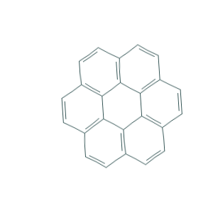 |    |
| | 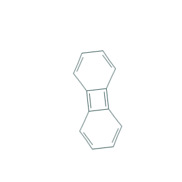 | 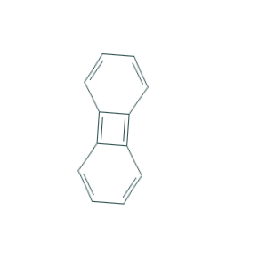 |   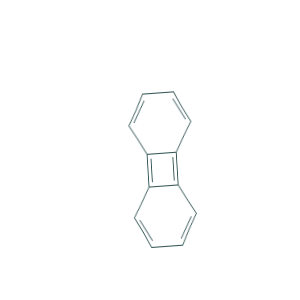 |
| | 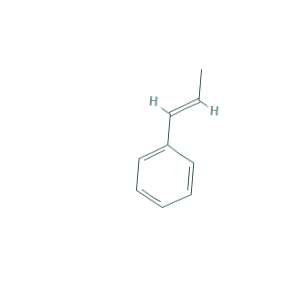 | 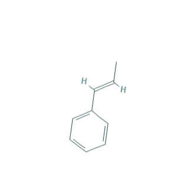 |   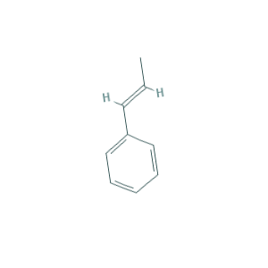 |

Using the weights and hyperparameters for the 3 class training model, I started training the 1,458 class model. Initially, I continued using the simpler augmentation parameters. This allowed me to generate and save model weights, with the intention of eventually increasing the difficulty of the training set. The accuracy and loss for this model can be seen in **Figure 2** and **Figure 3**.


**Figure 2**: Model accuracy for model trained using simpler augmentation parameters.


**Figure 3**: Model loss for model trained using simpler augmentation parameters.

I was finally able to increase the difficulty of the training set, using the augmentation parameters outlined in **Parameters 1**. As shown in **Table 3**, not only are there many images that are very similar to one another, the rotation and flipping of the augmented images increases the complexity of the dataset immensely. 

**Table 3**: Complex augmented images using Keras and more difficult augmentation parameters

| Structural Image      | Augmented Image Example 1 | Augmented Image Example 2 |
| :-----------: | :-----------:| :-----------: | 
| | 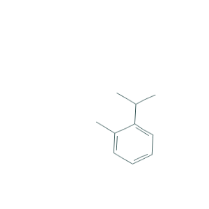 | 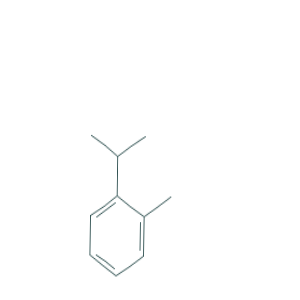 | 
| 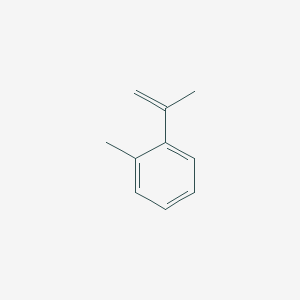| 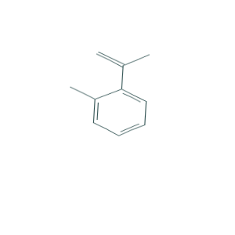 | 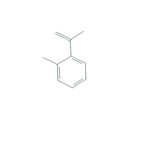 | 
| 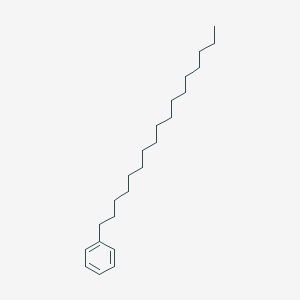| 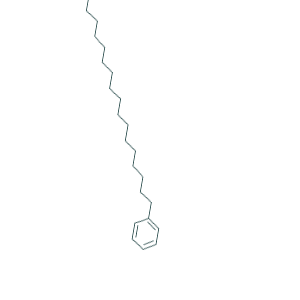 | 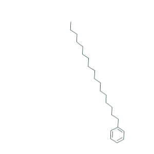 | 
| 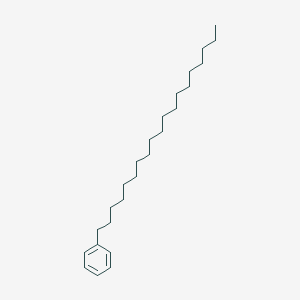|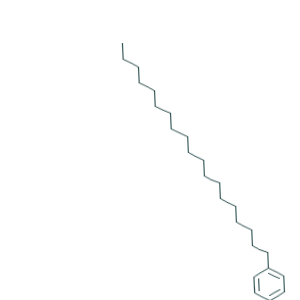 | 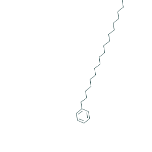 | 

The accuracy and loss for this model can be seen in **Figure 4** and **Figure 5**.


**Figure 4**: Model accuracy for model trained using wider augmentation parameters (including horizontal flipping).


**Figure 5**: Model loss for model trained using wider augmentation parameters (including horizontal flipping).

While it is far from perfect, this model can predict the correct class for any molecule with upwards of 80% accuracy. Given the limitations of the datase, this is well beyond the bounds of what was expected and is a pleasant surprise.

|    | Filename              | Prediction_1                      |   Percent_1 | Prediction_2                                                         |   Percent_2 | Prediction_3                                                                   |   Percent_3 |
|---:|:----------------------|:----------------------------------|------------:|:---------------------------------------------------------------------|------------:|:-------------------------------------------------------------------------------|------------:|
|  0 | CCCCCCCCCCCCCc1ccccc1 | CCCCCCCCCc1ccc(cc1)-c1ccccc1      |    0.983585 | CCCCCCCCCCCCCc1ccccc1                                                |   0.0160688 | CCc1ccc(CCc2ccc(CC)cc2)cc1                                                     | 0.000141693 |
|  1 | CCCCCCCCCCCCCc1ccccc1 | Cc1ccc(cc1)C#CC#Cc1ccc(C)cc1      |    0.567224 | CNCCNC1CC1C                                                          |   0.219104  | c1ccc(cc1)-c1ccc(cc1)-c1ccc(cc1)-c1ccc(cc1)-c1ccc(cc1)-c1ccccc1                | 0.119906    |
|  2 | CCCCCCCCCCCCCc1ccccc1 | NCCCCC1CC1                        |    0.313161 | O=CCCCCC=O                                                           |   0.284112  | OCCCOC1CC1                                                                     | 0.18207     |
|  3 | CCCCCCCCCCCCCc1ccccc1 | CCCCCCCCCc1ccc(cc1)-c1ccccc1      |    0.592663 | OCCCn1ccnn1                                                          |   0.151465  | CCCCCCCCCCC#Cc1ccccc1C                                                         | 0.0585987   |
|  4 | CCCCCCCCCCCCCc1ccccc1 | CC(C)CC#Cc1ccccc1                 |    0.487705 | CCCCCCC#Cc1ccc(CC)cc1                                                |   0.253339  | CCCCCCCC#Cc1ccc(C)cc1                                                          | 0.079489    |
|  5 | CCCCCCCCCCCCCc1ccccc1 | OCC=CCC1CC1                       |    0.213258 | NOCOC1CCOC1                                                          |   0.173308  | OCCNCC1CC1                                                                     | 0.171908    |
|  6 | CCCCCCCCCCCCCc1ccccc1 | CCCCCCCCCCC#Cc1ccccc1C            |    0.371923 | CCCCCCCCCCC#Cc1cccc(C)c1C                                            |   0.19844   | C#Cc1ccc(cc1)-c1ccc(cc1)C#C                                                    | 0.0544064   |
|  7 | CCCCCCCCCCCCc1ccccc1  | CCCCCCCCCCCCc1ccccc1              |    0.72134  | CCCCCCCCCCCCCCCCc1ccccc1                                             |   0.0676035 | C=CCc1ccc(Cc2ccccc2)cc1                                                        | 0.0486552   |
|  8 | CCCCCCCCCCCCc1ccccc1  | CCCCCCC#Cc1cc(C)c(C)cc1C          |    0.27461  | CCCCCCC#Cc1ccc(C)c(C)c1                                              |   0.215814  | CC(=C)CCc1ccc(cc1)C(C)(C)C                                                     | 0.134465    |
|  9 | CCCCCCCCCCCCc1ccccc1  | NCCCn1ccnn1                       |    0.689353 | CC(C)(c1ccccc1)C1(CC1)C#C                                            |   0.130788  | CC(=C)CCCCCCc1ccccc1                                                           | 0.100777    |
| 10 | CCCCCCCCCCCCc1ccccc1  | CCCCC#Cc1ccc(cc1)C(C)(C)C         |    0.494668 | CNCCn1ccnc1                                                          |   0.0842033 | CCCCC[C@H]1CC[C@@H](CC1)c1ccc(CCC)cc1                                          | 0.0834526   |
| 11 | CCCCCCCCCCCCc1ccccc1  | C(=Cc1ccc2ccccc2c1)c1ccc2ccccc2c1 |    0.379864 | c1cc2ccc1c1ccc(cc1)c1ccc(cc1)c1ccc(cc1)c1ccc(cc1)c1ccc(cc1)c1ccc2cc1 |   0.344739  | NCC=CCC1CC1                                                                    | 0.0751602   |
| 12 | CCCCCCCCCCCCc1ccccc1  | N#CCCCNC#N                        |    0.495172 | NCCCB(O)O                                                            |   0.189736  | c1cc2ccc1c1ccc(cc1)c1ccc(cc1)c1ccc(cc1)c1ccc(cc1)c1ccc(cc1)c1ccc(cc1)c1ccc2cc1 | 0.11116     |
| 13 | CCCCCCCCCCCCc1ccccc1  | OCCOC1CCNC1                       |    0.156021 | OCCNC1CCNC1                                                          |   0.0983546 | CCCCCCCCCCC#Cc1cccc(C)c1C                                                      | 0.079569    |


| Image  | Prediction 1  |   Percent | Prediction 2   |   Percent | Prediction 3 |   Percent |
|:---------:|:--------------:|:------------:|:---------------:|:------------:|:-------------:|:-----------:|
| -c1ccc(CC=C)cc1/C=CCc1ccc(cc1)-c1ccc(CC=C)cc1.png)|-c1ccc(CC=C)cc1/C=CCc1ccc(cc1)-c1ccc(CC=C)cc1.png)| 97.4 |C12CC(C1)C2/C#Cc1ccc(cc1)C12CC(C1)C2.png) | 1.1 |c1ccccc1/C1C(=CC=C1c1ccccc1)c1ccccc1.png) | 0.5 |
| Cc1ccccc1-c1ccccc1/CC(=C)Cc1ccccc1-c1ccccc1.png)|c1ccccc1/CC=C(c1ccccc1)c1ccccc1.png)| 61.6 |c(\C=C\c2ccccc2C=C)c(C)c1/Cc1cc(C)c(\C=C\c2ccccc2C=C)c(C)c1.png) | 33.0 |Cc1ccccc1-c1ccccc1/CC(=C)Cc1ccccc1-c1ccccc1.png)| 1.4 |
| |-c1ccccc1/CCCCCCCCCc1ccc(cc1)-c1ccccc1.png)| 70.5 |  |  26.9 |c(C)c1/CCCCCCC#Cc1ccc(C)c(C)c1.png)|  1.7 |
|  || 62.7 |  |  23.1  |   | 3.5 |
| c1CCC=C/Cc1cccc(C)c1CCC=C.png)  | c1CCC=C/Cc1cccc(C)c1CCC=C.png) | 85.7 | c(C)c(CCC=C)c1C/Cc1cc(C)c(C)c(CCC=C)c1C.png)| 11.0 | (C)C(C#C)(c1ccccc1)c1ccccc1/CC(C)(C)C(C#C)(c1ccccc1)c1ccccc1.png) | 1.2 |
